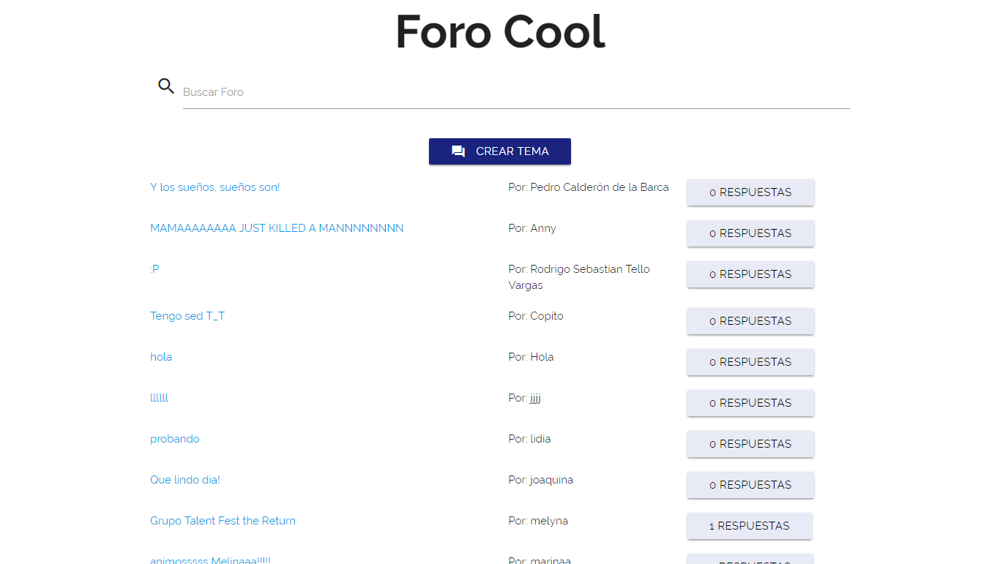
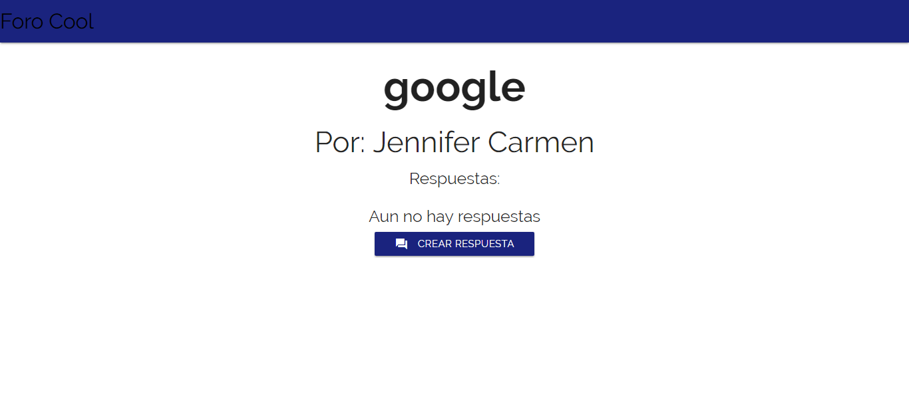

	
	</img>

  
  <a href="https://travis-ci.org/t4t5/sweetalert"><a>
  

##  Especificaciones
Vamos a crear un foro donde podamos crear temas y responder a esos temas.

Un tema tiene:

1. Un título
2. Un contador de número de respuestas
3. Un autor
4. Una respuesta tiene:

* Un topic_id (para saber de que tema es la respuesta)
* El contenido de la respuesta
* El autor

## Planificación

Habiendo que realizar 2 proyectos en parejas, se decidio
avanzar cada una un repositorio hasta la mitad y despues se intercambiaron los proyectos, de esa manera avanzamos  partes iguales, tanto diseño como funcionalidad en ambos proyectos.

Para una comunicacion segura y eficaz se utilizo whatsapp,
una aplicacion de chat para telefonos moviles.

## **FORUM**

Se creo FORUM, un espacio de opinion abierto,  para que el publico pueda comentar los temas de la actualidad, compartir ideas, recomendaciones y dar consejos a otras personas.
El proposito de FORUM es que grupos de intereses comunes interactuen entre si.

## Vistas

##  Tecnologias Usadas
- jquery
- materialize
- javascript
- Html5
- Api de Laboratoria

## Autores

- **Claudia Garibotto** - [@Claudiagari](https://github.com/Claudiagari)

- **Wendy Quispe** - [@wendytamara](https://github.com/wendytamara)

## Licencia

Este proyecto está licenciado bajo la Licencia ISC - ver el archivo [LICENSE](https://www.isc.org) para más detalles.

Copyright &copy; 2018 All Rights Reserved.
